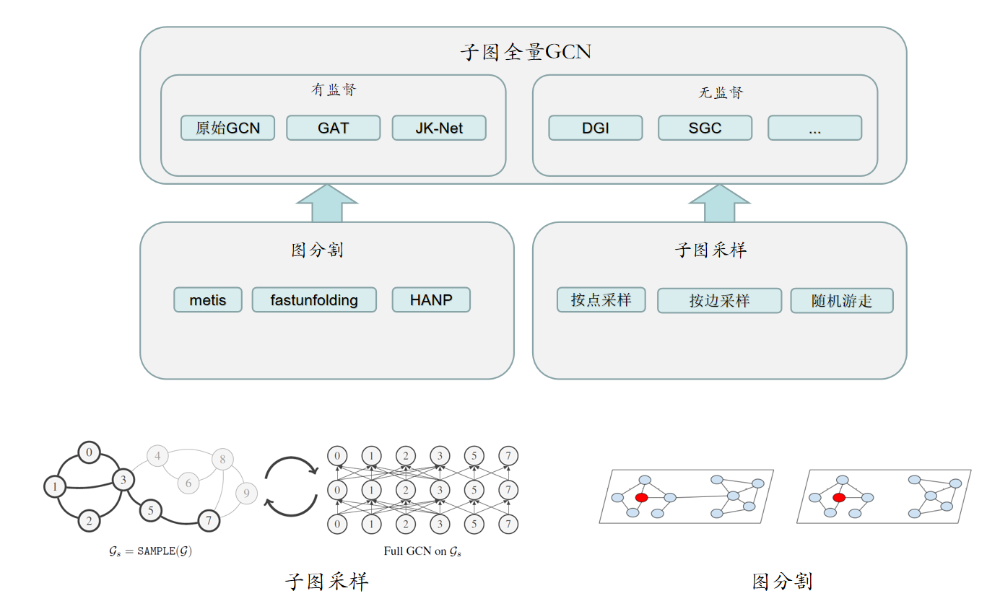

# 大规模图神经网络框架
基于图分割和子图全量图神经网络(Graph Convoutional Networks, GCN)的大规模图神经网络框架。可用于游戏内丰富的应用场景，比如好友召回，未成年人识别、广告推荐等。本目录以和平精英好友召回为例，对2亿+游戏玩家组成的游戏社交关系图训练5层有监督GCN模型。以预测流失玩家的回流概率。


### Prerequisites
* Python 3.7
* tensorflow-gpu>=1.12.0
* networkx==1.11
* numpy>=1.15.4
* scipy>=1.2.0
* scikit-learn>=0.19.1
* metis
* setuptools

## Models
目前该大规模GCN框架已实现以下模型。
* `Cluster GCN`: models.py中的GCN类, 对经过图分割算法(Spark实现)切分的子图，进行多层全量图卷积计算，得到节点的embedding表示，以预测节点(玩家)标签。每个子图作为一个输入batch，更新一个全局的图网络模型。
* `Deep Graph Infoxmax (DGI)`: ../dapan_emb/models/dgi.py, 对经过图分割算法(Spark实现)切分的子图学习无监督节点embedding表示。利用对比学习，对原始子图和经过随机破坏的子图构建最大互信息损失函数。

## Running the tests
训练、测试脚本是本目录中的run.sh文件。
### 训练 Cluster-GCN模型
```
python train_callback.py --dataset jdqssy --data_prefix /jdqssy/callback/ --nomultilabel --num_layers 5 --num_clusters 1000 --bsize 1 --layernorm --precalc True --hidden1 128 --dropout 0.0 --weight_decay 0  --early_stopping 1000 --num_clusters_val 1000 --num_clusters_test 1000 --epochs 100 --save_name /callback/202012/clustergcn_model --diag_lambda 1 --statis_date 20200713
```
根据配置的图网络参数，迭代训练模型，在验证集上获得f1-score提升。以下为结果输出样例。
```
INFO:tensorflow:Epoch: 0001 training time: 18.29093 train_acc= 0.74551 train_loss= 0.43587 val_acc= 0.75029 mi F1= 0.75029 ma F1= 0.71874 val_loss= 0.43125 
INFO:tensorflow:Epoch: 0002 training time: 35.12918 train_acc= 0.75919 train_loss= 0.42347 val_acc= 0.75096 mi F1= 0.75096 ma F1= 0.71464 val_loss= 0.43033 
INFO:tensorflow:Epoch: 0003 training time: 51.94466 train_acc= 0.75386 train_loss= 0.42979 val_acc= 0.75107 mi F1= 0.75107 ma F1= 0.72261 val_loss= 0.43014 
INFO:tensorflow:Epoch: 0004 training time: 68.99974 train_acc= 0.73718 train_loss= 0.44806 val_acc= 0.75077 mi F1= 0.75077 ma F1= 0.72551 val_loss= 0.43039 
INFO:tensorflow:Epoch: 0005 training time: 85.67941 train_acc= 0.74795 train_loss= 0.43183 val_acc= 0.75078 mi F1= 0.75078 ma F1= 0.71321 val_loss= 0.43052 

              precision    recall  f1-score   support

           0     0.9442    0.9899    0.9665   3493007
           1     0.8165    0.4340    0.5667    360839

   micro avg     0.9379    0.9379    0.9379   3853846
   macro avg     0.8804    0.7120    0.7666   3853846
weighted avg     0.9323    0.9379    0.9291   3853846
```


### 利用训练好的 Cluster-GCN模型预测和平精英玩家的回流概率
```
python test_callback.py --dataset jdqssy --data_prefix /callback/ --nomultilabel --num_layers 5 --num_clusters 1000 --bsize 1 --layernorm --precalc True --hidden1 128 --dropout 0.0 --weight_decay 0  --early_stopping 1000 --num_clusters_val 1000 --num_clusters_test 1000 --epochs 100 --save_name /callback/202012/clustergcn_model --diag_lambda 1 --statis_date 20200720
```
根据配置的图网络参数计算待预测玩家的P值(分值, 未经过sigmoid归一化)。以下为结果输出样例。
```
20210103^A59ED231FADD6CE38FA48ED5C58D5443E^A2318165806^A-0.42435536
20210103^A72A82C95203E6790ACCB58A9FF3B3557^A4465192836^A1.2665211
20210103^AF1F9400E1F898ABD505D24ADE071F74E^A4430638637^A-0.594237
20210103^A643F1FCA187EAE9A5C0AB2E9584D1F73^A4454088225^A-0.75172585
20210103^A039366FF981BA0C4FA6C12C6BF7C5C0D^A4300507110^A-0.38986883
20210103^AA42B68B7A0C245DECF292368EB6C5A14^A489913182^A-0.44822133
20210103^A57068A684BBA3A373160EB769BE45C5C^A2468619965^A-0.874013
20210103^A0702714C44FA0754665E844E830E3553^A495503397^A2.7857895
20210103^AosewR0u9jrVT81pB5zTszj0EvIKg^A3547113546^A-1.4937632
20210103^AC86818F034FC59600FFDA91C54600855^A4370176264^A-2.3853867
20210103^AA1610DBB07BC26E8C13BBA5C61614BFB^A4233126972^A3.0820272
20210103^A6B56C9E853272B36E5C1025C1CC84484^A2466953640^A-0.4866414
20210103^A8CC5DF091FA706FAD6165D908C7E35D4^A215970428^A-1.3921325
```

## Code Structure

```
├─ inits.py                     //实现了不同的神经网络参数初始化方法
├─ layers.py                     //实现了不同的神经网络层
├─ metrics.py                    //实现了不同的损失函数度量、以及精度计算方法
├─ models.py                     //实现了多层GCN模型，多层感知机模型
├─ test_callback..py            //和平精英好友召回Cluster GCN预测
├─ train_callback.py            //和平精英好友召回Cluster GCN训练
├─ utils.py                     //实现了读Spark产生的子图文件方法, 以及各种预处理方法